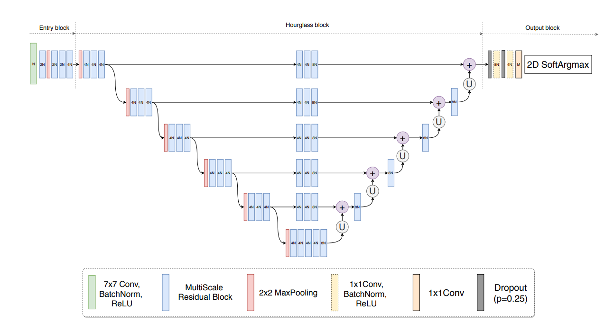
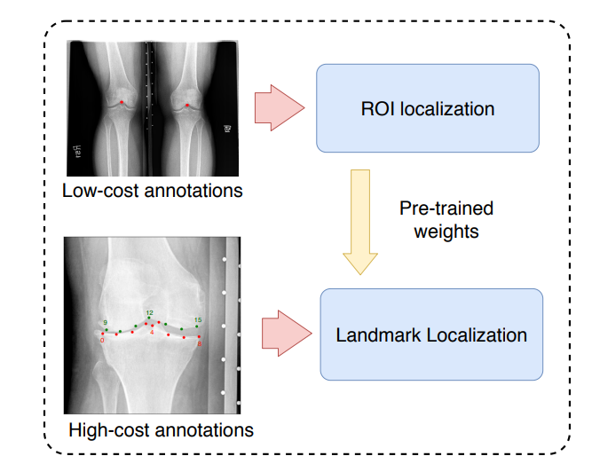

# KNEEL: Hourglass Networks for Knee Anatomical Landmark Localization

(c) Aleksei Tiulpin, University of Oulu, 2019

## About
### Approach
In this paper we tackled the problem of anatomical landmark localization in knee radiographs at all stages of osteoarthritis. We combined recent advances of landmark localization field and distilled them into a novel modification of hourgalss architecture:
<center>
 
</center>

To train this model, we propose to use mixup, coutout augmentation and dropout and **no weight decay**. We further propose to use transfer learning from low-cost annotations (knee joint centers on the whole knee radiographs). In the paper, we showed that our transfer learning technique allows to significantly bost the performance. Furthermore, having the models trained to work with the while radiographs and the localized knee joint areas, we were able to build a full pipeline for landmark localization.
<p align=center>
 
</p>

### What's included

The repository includes the codes for training and testing, 
annotations for the OAI dataset and also the links to the pre-trained models.

## How to install and run
### Preparing the training data
Download the OAI baseline images from https://nda.nih.gov/oai/. The access to the images is free and painless.
You just need to register and provide the information about yourself and agree with the terms of data use.

We provide the script and the annotations for creating the cropped ROIs from the original DICOM images. 
The annotations are stored in the file `annotations/bf_landmarks_1_0.3.csv`. 
The script for creating the high cost and the low cost datasets 
from the raw DICOM data is stored in `scripts/data_stuff/create_train_dataset_from_oai.py`.

Execute the aforementioned script as follows:
```
python create_train_dataset_from_oai.py --oai_xrays_path <OAI_PATH> \
                                        --annotations_path ../annotations \
                                        --to_save_high_cost_img <path the images corresponding to high-cost annotations> \
                                        --to_save_low_cost_img <path the images corresponding to low-cost annotations>
```
Here, `<OAI_PATH>` should correspond to the folder with OAI baseline images containing the file `contents.csv`.

After you have created the dataset, you can follow the script `run_experiments.sh` and setup the `--data_root` parameter to be
the same as `<path the images corresponding to high/low-cost annotations>`. 

Note: you will likely see warnings `UserWarning: Incorrect value for Specific Character Set 'ISO_2022_IR_6' - assuming 'ISO 2022 IR 6'
  _warn_about_invalid_encoding(encoding, patched)`. Don't pay attention to that, as these are the artifacts coming from DICOM metadata.

### Reproducing the experiments from the paper
All the experiments done in the paper were made with PyTorch 1.1.0 and anaconda.
To run the experiments, simply copy the content of the folder `hc_experiments` into `hc_experiments_todo`. 
Set up the necessary environment variables in the file `run_experiments.sh` and then run this script. 
The code is written to leverage all the available GPU resources running 1 experiment per card.

## Inference on your data

1. Build the docker image `docker build -t kneel_inference -f Dockerfile.xxx .`, where `xxx` is either `cpu` or `gpu`.
2. Download the models: `sh fetch_snapshots.sh`
3. Run the inference as follows (remember to use `nvidia-docker` for cuda support):

```
docker run -it --name landmark_inference --rm \                                                                                                                                                               ✔  118  18:33:53
            -v <WORKDIR_LOCATION>:/workdir/ \
            -v $(pwd)/snapshots_release:/snapshots/:ro \
            -v <DATA_LOCATION>:/data/:ro --ipc=host \
            kneel_inference python -u inference_new_data.py \
            --dataset_path /data/ \
            --dataset <DATASET_NAME> \
            --workdir /workdir/ \
            --mean_std_path /snapshots/mean_std.npy\
            --lc_snapshot_path /snapshots/lext-devbox_2019_07_14_16_04_41 \
            --hc_snapshot_path /snapshots/lext-devbox_2019_07_14_19_25_40 \
            --device <DEVICE> \
            --refine True

```

In the command above, you need to replace:

* `<WORKDIR_LOCATION>` - where you will be saving the results.
* `<DATA_LOCATION>` where the data are located. 
* `<DATASET_NAME>` the name of the folder containing DICOM images. It should be a sub-folder of `<DATA_LOCATION>`.
* `<DEVICE>` - `cuda`or `cpu` depending on the platform of execution and on how you built the docker image.

You can fetch the prebuild docker images as `docker pull lextdocker/kneel:cpu` or `docker pull lextdocker/kneel:gpu` for CPU or GPU, respectively. 
Please note that your NVIDIA driver must be compatible with cuda 10.

## License
If you use the annotations from this work, you must cite the following paper (Accepted to ICCV 2019 VRMI Workshop)

```
@article{tiulpin2019kneel,
  title={KNEEL: Knee Anatomical Landmark Localization Using Hourglass Networks},
  author={Tiulpin, Aleksei and Melekhov, Iaroslav and Saarakkala, Simo},
  journal={arXiv preprint arXiv:1907.12237},
  year={2019}
}
```

The codes and the pre-trained models are not available for any commercial use 
including research for commercial purposes.
